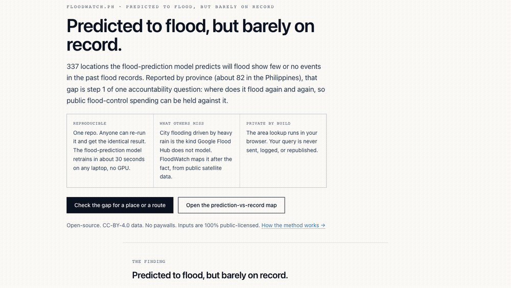

# FloodWatch.PH

[](https://github.com/xmpuspus/floodwatch-ph/actions/workflows/ci.yml)
[](LICENSE)
[](LICENSE)
[](https://www.python.org/downloads/)
[](#track-b--recurrence-model-reproducible)
[](MODEL_CARD.md)
[](https://doi.org/10.5281/zenodo.PENDING)

> FloodWatch.PH: open-source flood-extent measurement and flood-recurrence classification for the Philippines from public satellite data. Flooding is temporal where rooftop solar is static, so this is an honest **two-track** system, and the two tracks are reported with **separate** metrics, never averaged. **Track A** (the demo) is classical, training-free Sentinel-1 SAR change detection: SAR penetrates typhoon cloud cover, which is the only reason a flood is observable at all during a Philippine typhoon (optical is blind exactly when it matters). **Track B** (the model) is the SolarMap analog: a frozen Google AlphaEarth Foundations Satellite Embedding (2017, 64-dim, CC-BY-4.0), a scikit-learn logistic-regression head, Platt-sigmoid calibration on an **event-disjoint** holdout (whole typhoon events held out, never random pixels), and a bit-exact reproducible build.



<sub>Real recording of the `/map` page. The time slider steps through 4 real Sentinel-1 acquisition dates bracketing Super Typhoon Carina (Gaemi) and the enhanced southwest monsoon, 2024. Permanent water (rivers, lakes, sea) is removed from every frame so the layer is flood, not hydrography. Detected flood peaks at 207 km² across the Metro Manila + Bulacan + Pampanga area of interest. Click a province and the sidebar returns its WorldPop population, GHSL built-up area, the share of its area flooded at the event peak, and its historical Global Flood Database event count. Carina 2024 has no promptly-public official flood-extent polygon; that absence is the civic vacuum this fills.</sub>

## What's in this repo

- **`event/`**: Track A, the Sentinel-1 SAR event flood-extent pipeline. `flood_extent.py` pulls `COPERNICUS/S1_GRD` (VH, IW mode) for an event window, builds a dry pre-event baseline, applies Otsu thresholding to the event VH image, gates on "got darker than the dry baseline" (so a permanently dark surface is not called flood), then removes permanent water (`permanent_water.py`: JRC Global Surface Water occurrence >= 50% plus MERIT Hydro water cells), removes steep slope, and applies a HAND-style flood-plausible-terrain mask that suppresses the well-known Philippine rice-agriculture SAR false positive. Output is one per-timestep flood-polygon GeoJSON per event. `events.json` is the event registry.
- **`model/`**: Track B, the AlphaEarth recurrence model. `bootstrap_labels.py` queries the Global Flood Database for every Philippine flood event and builds the event-disjoint split (40 train, 17 holdout events; `holdout_events.json`, hash-pinned). `fetch_embeddings.py` samples the frozen AlphaEarth 2017 embedding at flood-recurrence-labelled points (permanent water removed) into the committed `embeddings/floodwatch_embeddings_v1.npz` cache (~1 MB, in git). `train.py` fits the logistic-regression head; `calibrate.py` fits Platt sigmoid on the event-disjoint holdout and emits the national recurrence-prone point layer.
- **`pipeline/`**: the exposure and civic-gap join. `exposure.py` aggregates WorldPop population and GHSL built-up area per province over the event AOI. `hazard_gap.py` is the civic layer: the gap between modeled flood-proneness (Track B) and the historical observed flood record (GFD).
- **`site/`**: the Astro static site. `/map` is the Track A time-slider demo; `/methodology`, `/recurrence`, `/privacy`, `/faq`, `/safety` document the two tracks, the honest separate metrics, and the RA 10173 posture.
- **`scripts/`**: the integrity gates. `check_permanent_water.py` (every published flood file is permanent-water-masked), `check_event_disjoint.py` (no holdout event leaks into training; split hash matches), `check_no_pii.py` (outputs are province aggregates only), `verify_release.py` (full pre-release runner), `verify_clf.py` (hash-verify a joblib before `joblib.load`).
- **`tests/`**: pytest suite, no network.

## What this is not

- Not a real-time flood warning system. Sentinel-1 has a multi-day revisit; each slider frame is a real past acquisition, not a live feed. For warnings, use PAGASA and your LGU DRRM office.
- Not a substitute for the official hazard maps. The official UP NOAH / Project NOAH / PAGASA / MGB layers are the authoritative planning instruments. FloodWatch is an independent, reproducible *observation* of where water actually was, and a *model* of where it recurs.
- Not address-level. Exposure is aggregated to province. No household geometry, no per-dwelling flood status, no PII. Barangay resolution is a documented v1.1 refinement (Philippine barangay polygons are not a clean public asset).
- Not an accusation. FloodWatch publishes statistical and observational indicators derived from public satellite data. Patterns may have legitimate explanations and figures warrant independent verification.

## Privacy and responsible use

FloodWatch.PH is a civic-tech research artifact. Inputs are publicly licensed (Sentinel-1 / Copernicus, Google AlphaEarth, Global Flood Database, MERIT Hydro, JRC Global Surface Water, WorldPop, Microsoft GlobalML Building Footprints, OpenStreetMap, PSA). Outputs inform public-interest reporting and LGU disaster planning on the gap between where floods are observed to recur and where the official hazard maps and damage assessments say they do.

Environmental flood data carries lower RA 10173 (Data Privacy Act of 2012) exposure than rooftop-level imagery, but the publication boundary is still enforced: every exposure figure is a province-level aggregate. No household is identified. No per-dwelling flood-status geometry is published. The full posture is in [`docs/privacy-impact-assessment.md`](docs/privacy-impact-assessment.md).

- **DPO (self-designated):** Xavier Puspus, `xpuspus@gmail.com`. Formal NPC registration is in scope for the post-launch quarter.
- **Takedown channel:** open a [GitHub issue with the `takedown` label](https://github.com/xmpuspus/floodwatch-ph/issues/new?labels=takedown). Acknowledged within 5 working days.

> All data sourced from public records and public satellite archives. FloodWatch.PH computes statistical and observational indicators only. Specific allegations, if any, require independent investigation and corroboration.

## Quickstart for researchers

The model track is bit-exact reproducible from the committed embeddings cache, no network and no GPU, in about 30 seconds:

```bash
git clone https://github.com/xmpuspus/floodwatch-ph
cd floodwatch-ph

python3 -m venv .venv && source .venv/bin/activate
pip install -r requirements.txt

make train          # logistic-regression head from the committed npz cache
make hash-verify    # asserts sha256 b7c702532f92c43f
make calibrate      # Platt sigmoid on the event-disjoint holdout
make demo           # prints the calibrated bundle + holdout metrics
make test           # pytest, ~1 second
```

To run the full release-readiness gates (permanent-water masking, event-disjoint integrity, no-PII, site/data mirror, classifier hash):

```bash
make verify
```

To regenerate the data from Earth Engine, set `EE_KEY_FILE` to a Google Earth Engine service-account key JSON path (`project_id` and `client_email` are read from the key; a free Earth Engine account is sufficient), then:

```bash
make labels         # GFD -> recurrence labels + event-disjoint split
make embeddings     # sample AlphaEarth at labelled points -> npz cache
make event          # Track A: Sentinel-1 flood extent for an event
make exposure       # province exposure + modeled-vs-observed gap
```

## Quickstart for the site

```bash
cd site
pnpm install
pnpm dev          # http://localhost:4321
pnpm typecheck
pnpm build        # production build (astro check + astro build)
```

## Track B - recurrence model (reproducible)

The recurrence classifier (frozen AlphaEarth embedding + logistic regression + Platt calibration) ships with a Makefile, a Dockerfile, and pinned dependencies. It is bit-exact reproducible from the committed `model/embeddings/floodwatch_embeddings_v1.npz` (~1 MB, in git).

```bash
# Local
pip install -r requirements.txt
make train
make hash-verify        # asserts recurrence_clf_v1.joblib sha256 b7c702532f92c43f

# Docker
docker build -t floodwatch-ph:latest .
docker run --rm floodwatch-ph:latest          # default: make hash-verify
```

Pinned `scikit-learn`, `joblib`, `numpy`, `scipy` make the joblib bytes deterministic across Linux and macOS. A different scikit-learn produces a different hash; the `EXPECTED_HASH` in the `Makefile` is bumped intentionally on upgrades. If someone sends you a classifier `.joblib`, hash-verify it before `joblib.load` (pickle executes arbitrary code): `python3 scripts/verify_clf.py path/to/clf.joblib`.

## Earth Engine pipeline

Both tracks pull from Earth Engine with server-side reduction and small client downloads only. There is no bulk raw-imagery fetch and no tile-throttling failure mode by design. Sentinel-1 and AlphaEarth are the substrate; nothing is scraped.

## The two tracks

Flooding is an event; rooftop solar is a fixture. A single high-resolution snapshot, the SolarMap move, cannot work for flood, and the typhoon that causes the flood is exactly the cloud that blinds optical sensors. So FloodWatch is two tracks with two jobs and two honestly separate metrics.

| | Track A - event | Track B - recurrence model |
|---|---|---|
| Sensor | Sentinel-1 C-band SAR (VH) | AlphaEarth Satellite Embedding V1 (2017) |
| Method | Otsu + change gate + permanent-water + HAND-style mask | LogisticRegression + Platt calibration |
| Trained? | No (classical, parameter-free) | Yes (event-disjoint holdout) |
| Job | the reproducible observed-extent time series (the demo) | flood-recurrence-prone classification |
| Metric | IoU/F1 vs GFD + terrain-plausibility (transparently caveated) | precision / recall / F1 / Brier on held-out events |

## Headline numbers, with footnotes

### Track A - event flood extent (Sentinel-1 SAR, classical)

- Validated against the Global Flood Database `flooded` polygon for **GFD event 4300, Tropical Storm Koppu / Lando, 2015-10-22, central Luzon** (54 dead, severity 2), at GFD's native 250 m, permanent water removed from both.
- **IoU 0.061, precision 0.085, recall 0.061, F1 0.071.** This is reported plainly because it is honest, not because it is flattering: the only Sentinel-1 acquisition is several days after GFD onset, and a single 10 m SAR pass versus a multi-day 250 m optical product see different water. Low pixel agreement against a coarse, temporally-offset optical reference is the expected, documented limitation of this comparison, not a hidden one. Track A's value is the reproducible, permanent-water-masked observed-extent time series; the trained-model claim is carried by Track B's event-disjoint metrics, not by this number.
- The Carina 2024 demo event peaks at **207 km²** of detected flood across 4 real Sentinel-1 acquisition dates, permanent water removed from every frame.

### Track B - recurrence-prone classifier (AlphaEarth + logistic regression)

- Trained on the Global Flood Database Philippine record (57 events, 2002-2017) with an **event-disjoint** split: 40 whole events for training, 17 whole events held out. A point flooded in both a train and a holdout event is dropped, so no point can leak across the boundary. This is the single most important honesty decision; random-pixel splits inflate every metric because adjacent pixels are near-duplicates.
- 6700 positive and 4500 negative sample points. Negatives are land that never flooded across any GFD event.
- On the event-disjoint holdout (2200 positive, 1346 negative): **precision 0.949, recall 0.962, F1 0.955, AUC 0.974, Brier 0.046** at the deployed threshold. The negative class is "never-flooded land", an easier contrast than hard negatives near floodplains; this is stated in the model card so the number is not over-read.

## Policy context

This dataset only matters because the policy context is contested. Philippine communities flood repeatedly while the official hazard maps and the NDRRMC post-event damage assessments do not agree with each other or with what satellites observed. v1.0 ships the fully-public-chain civic layer: the gap between modeled flood-proneness (Track B) and the historical observed flood record (GFD), per province, with "under-observed prone" flagged where the model says prone but the historical record barely captured it. The cross-reference against the official UP NOAH / PAGASA / MGB hazard maps is the v1.1 extension, deferred for a documented reason: those government layers are token-gated ArcGIS or single-page-app only, the well-known Philippine civic-data access failure mode. Conservative language is used throughout and every analytics surface carries the public-records disclaimer.

## Project layout

```
floodwatch-ph/
|-- event/                  # Track A: Sentinel-1 SAR event flood extent
|   |-- flood_extent.py     # Otsu + change gate + perm-water + HAND-style mask
|   |-- permanent_water.py  # the integrity mask (decision 2)
|   |-- fetch_s1_event.py   # S1 acquisition-coverage probe
|   `-- events.json         # event registry (demo + validation)
|-- model/                  # Track B: AlphaEarth embeddings + recurrence head
|   |-- embeddings/floodwatch_embeddings_v1.npz   # committed cache (in git)
|   |-- bootstrap_labels.py # GFD -> labels + event-disjoint split
|   |-- fetch_embeddings.py # sample AlphaEarth at labelled points
|   |-- train.py  calibrate.py
|   |-- holdout_events.json # event-disjoint split (hash-pinned)
|   `-- recurrence_clf_v1.joblib                   # committed, hash-verified
|-- pipeline/               # exposure + civic gap join
|   |-- exposure.py  hazard_gap.py
|-- site/                   # Astro static site, MapLibre time slider
|   |-- public/data/        # flood timesteps + recurrence + gap + SCHEMA.md
|   |-- src/data/events.json # mirrored from event/events.json (Vercel boundary)
|   `-- vercel.json
|-- scripts/                # integrity gates + release runner
|-- tests/                  # pytest, no network
|-- docs/
|   |-- research/floodwatch-spec.md     # the locked end-to-end spec
|   |-- privacy-impact-assessment.md
|   `-- screenshots/hero.gif
|-- MODEL_CARD.md  CITATION.cff  CHANGELOG.md  CONTRIBUTING.md
|-- CODE_OF_CONDUCT.md  SECURITY.md  LICENSE  Makefile  Dockerfile
|-- requirements.txt  pyproject.toml  .zenodo.json  README.md
`-- .github/workflows/ci.yml
```

## Methodology in one paragraph

Two tracks. **Track A**: a frozen, training-free Sentinel-1 pipeline. A dry pre-event VH baseline is differenced against each event-date VH image; Otsu picks the water/land split on the event image; pixels are kept only if they are dark (below Otsu), got darker than the dry baseline, are not permanent water (JRC GSW occurrence >= 50% or MERIT Hydro water), are not steep, and lie on HAND-style flood-plausible terrain. The result is vectorized per acquisition date. **Track B**: the frozen Google AlphaEarth 2017 64-dim embedding is sampled at GFD flood-recurrence-labelled points (permanent water removed); a scikit-learn logistic-regression head is trained on whole-event-disjoint training events and Platt-calibrated on whole held-out events; the bit-exact classifier is hash-verified. The civic layer is the gap between Track B proneness and the GFD historical observed record per province. Full algorithm and caveats are on `/methodology`.

## Data attribution

- **Sentinel-1** (ESA Copernicus, open): SAR backscatter for Track A.
- **Google AlphaEarth Foundations Satellite Embedding V1** (CC-BY-4.0): produced by Google and Google DeepMind. Track B substrate.
- **Global Flood Database** (Cloud to Street, Nature 2021; CC-BY-4.0): historical flood-event polygons; Track B labels and Track A validation.
- **MERIT Hydro** and **JRC Global Surface Water** (open): permanent-water and terrain masking.
- **WorldPop** (CC-BY-4.0): population exposure.
- **Microsoft GlobalML Building Footprints / GHSL** (open): built-up exposure.
- **OpenStreetMap** (ODbL) and **PSA**: administrative geography.
- **Copernicus EMS** and **UNOSAT**: event-mapping references (v1.1 validation).

## License

Code: MIT. Data products in `site/public/data/`: CC-BY-4.0. Cite as `FloodWatch.PH (2026), https://github.com/xmpuspus/floodwatch-ph`. See `CITATION.cff` for the canonical citation, `MODEL_CARD.md` for intended use and biases, `SECURITY.md` for the threat model.

Author: Xavier Puspus.

## Contributing

Highest-value contributions, in priority order: verified false-positive reports on any published flood polygon (with the date and a screenshot); additional GFD-gauged validation events; Copernicus EMS / UNOSAT polygon ingestion for a richer Track A validation; barangay-resolution boundary integration; the official-hazard-map overlay (v1.1); encoder ablations against TESSERA. See `CONTRIBUTING.md`.

## References

- Global Flood Database (Tellman et al., Nature 2021): https://global-flood-database.cloudtostreet.ai
- AlphaEarth Foundations Satellite Embedding V1: https://developers.google.com/earth-engine/datasets/catalog/GOOGLE_SATELLITE_EMBEDDING_V1_ANNUAL
- UN-SPIDER recommended practice, Sentinel-1 flood mapping: https://www.un-spider.org
- MERIT Hydro (Yamazaki et al., 2019); JRC Global Surface Water (Pekel et al., Nature 2016)
- Full bibliography: `docs/research/floodwatch-spec.md`
